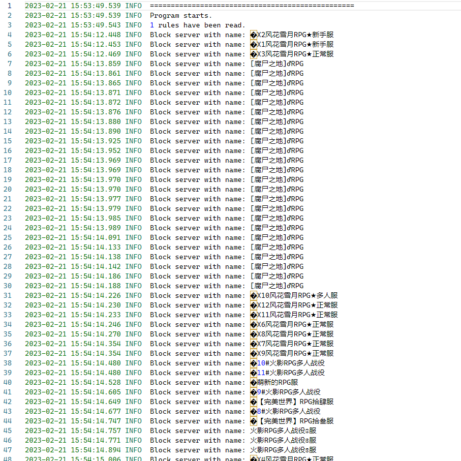
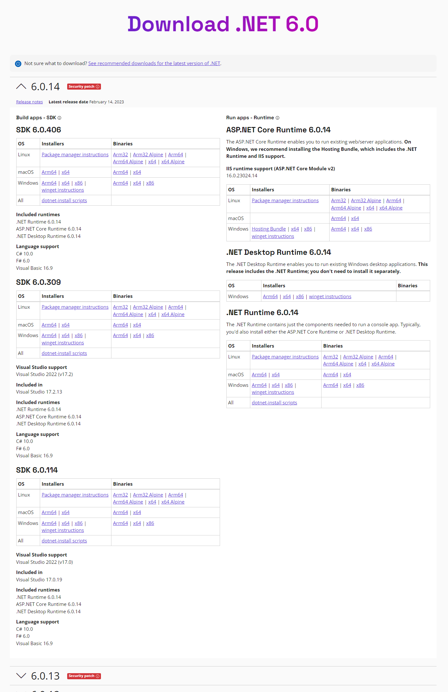
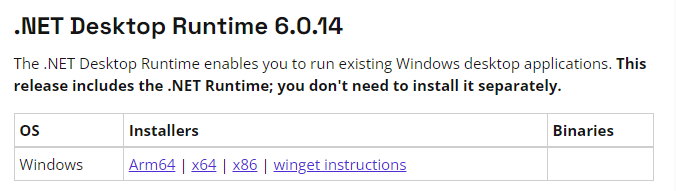
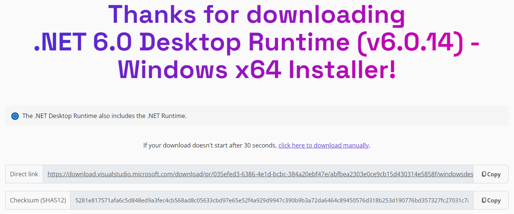
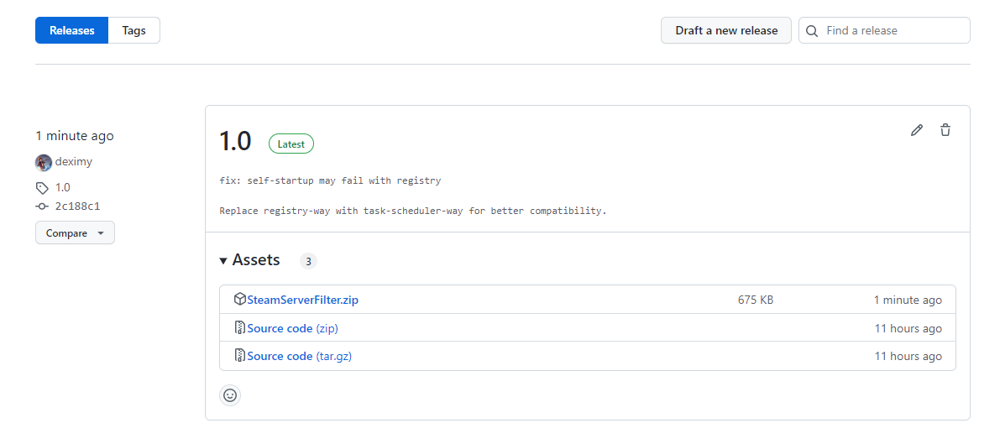
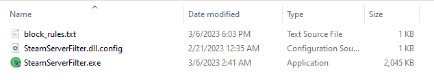
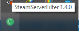
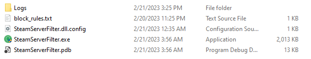
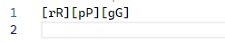

# SteamServerFilter

基于WFP的Steam组服务器过滤程序，可过滤任意名称中带有指定内容的服务器。

以下为效果展示：

## 先决条件

安装[.NET 6.0](https://dotnet.microsoft.com/en-us/download/dotnet/6.0)桌面运行时。

### 安装方法一：通过网页下载安装包进行安装

打开[.NET 6.0](https://dotnet.microsoft.com/en-us/download/dotnet/6.0)下载页面：

在右下部分找到.NET Desktop Runtime 6.0.xx（注意，此处版本号不固定，请以最新版为准）：

点击**x86**对应的链接，跳转到下载页面：

此时浏览器应该会自动开始下载，下载完成后直接安装即可。

### 安装方式二：通过winget进行安装

考虑到大部分人应该没有winget，（有winget的应该也不需要我教安装依赖），这里就只放安装命令：

`winget install Microsoft.DotNet.DesktopRuntime.6`

## 使用SteamServerFilter

### 下载

打开[程序发布页](https://github.com/deximy/SteamServerFilter/releases)：

点击最新版的、名为`SteamServerFilter.zip`压缩包进行下载。

### 运行

**注意：运行该程序需要管理员权限**

打开压缩包，将压缩包内的**所有**文件解压到任意文件夹：

双击**SteamServerFilter.exe**运行。

运行后程序**不会**有任何界面，但是会在托盘区生成一个程序图标：

并在程序运行目录下生成`Logs`文件夹：

### 添加、修改、删除屏蔽规则

所有规则均储存在程序运行目录下的`block_rules.txt`，每行一个：

每一行规则都**必须**是一个合法的正则表达式。例如，程序自带的规则`[rR][pP][gG]`将屏蔽所有同时包含了"R"、"P"、"G"三个字母的服务器，**不区分大小写**。

如果你不确定如何书写正确的正则表达式，**可以只填写需要过滤的关键词**，例如添加关键词"RPG"，那么所有包含了"RPG"关键词的服务器名都将被过滤（注意，**此处区分大小写**）。

**每次修改完配置文件后请务必通过托盘菜单重载规则（你愿意的话，重启程序也行），并检查重载后的log中是否读取了正确数量的规则。**

**重载不会清除已被之前规则所屏蔽的服务器的屏蔽状态，即使你已经删除对应的规则。例如，即使删除了自带的规则，已经被屏蔽的名称中包含字符串RPG的服务器仍然会保持无法连接的状态。如果需要清除该状态，请重启程序。**

### 退出程序

在托盘图标上右键退出。

### 开机自动启动

为了实现更好的效果，该程序支持开机30s后自动启动。在托盘图标上右键勾选/取消开机自动启动即可开启/关闭该功能。
